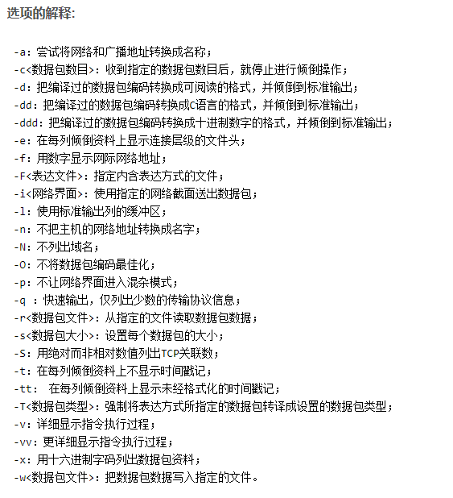
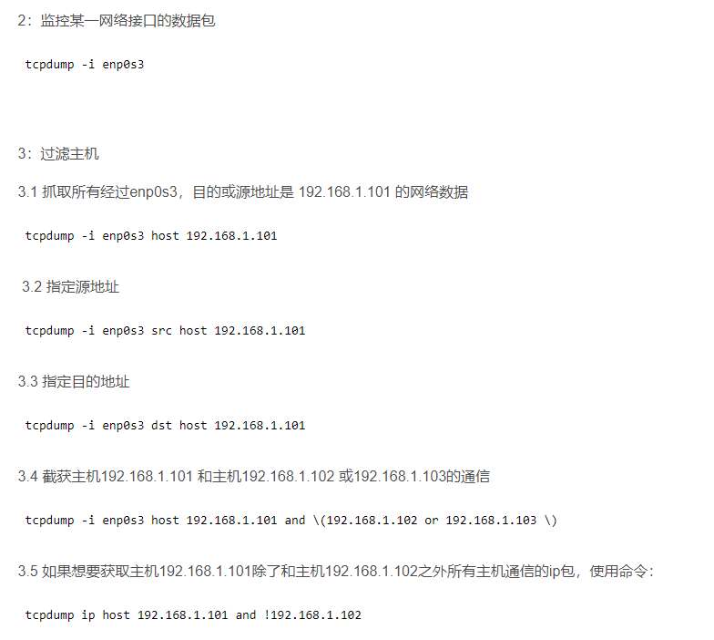
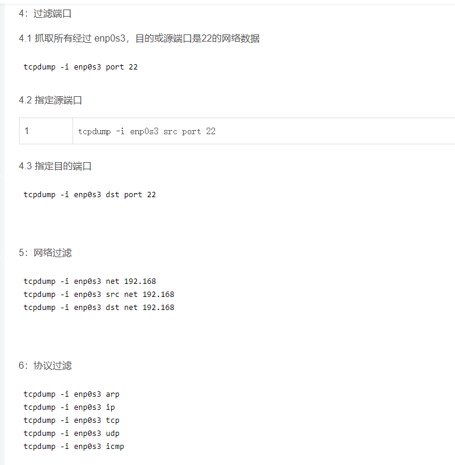
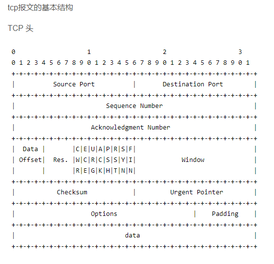

### tcpdump命令格式

tcpdump \[ -DenNqvX ]\[ -c count ] \[ -F file ]\[ -i interface ]\[ -r file ]\[ -s snaplen ]\[ -w file ][ expression ]

tcpdump port 8916 -i any -s0 -w dump.8916
抓包8916端口，放到dump.8916文件
使用Wireshark来查看文件