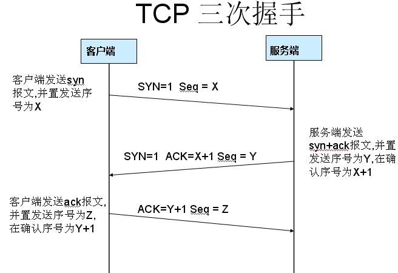
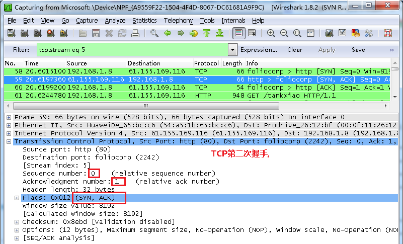
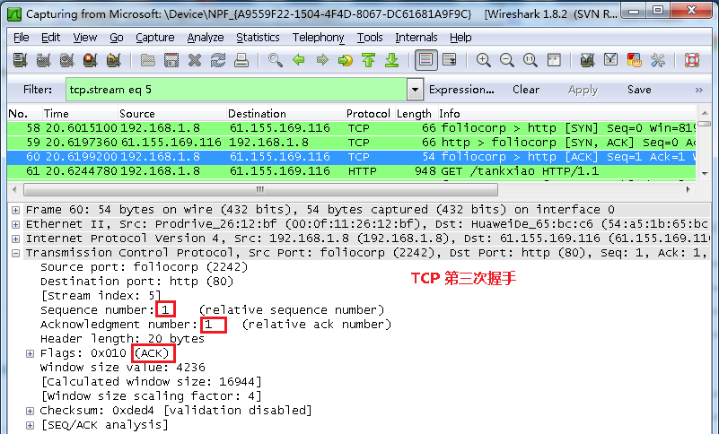

# wireshark与对应的OSI七层模型

- Frame:   物理层的数据帧概况

- Ethernet II: 数据链路层以太网帧头部信息
- Internet Protocol Version 4: 互联网层IP包头部信息
- Transmission Control Protocol:  传输层T的数据段头部信息，此处是TCP
- Hypertext Transfer Protocol:  应用层的信息，此处是HTTP协议

# TCP包的具体内容

# 实例分析TCP三次握手过程

- 第一次握手数据包
  - 客户端发送一个TCP，标志位为SYN，序列号为0， 代表客户端请求建立连接
  - 
- 第二次握手的数据包
  - 服务器发回确认包, 标志位为 SYN,ACK. 将确认序号(Acknowledgement Number)设置为客户的I S N加1以.即0+1=1
  - 
- 第三次握手的数据包
  - 客户端再次发送确认包(ACK) SYN标志位为0,ACK标志位为1.并且把服务器发来ACK的序号字段+1,放在确定字段中发送给对方.并且在数据段放写ISN的+1
  - 

图中可以看到wireshark截获到了三次握手的三个数据包。第四个包才是HTTP的， 这说明HTTP的确是使用TCP建立连接的。

2、tcpdump port 8916 -i any -s0 -w dump.8916
抓包8916端口，放到dump.8916文件
使用Wireshark来查看文件