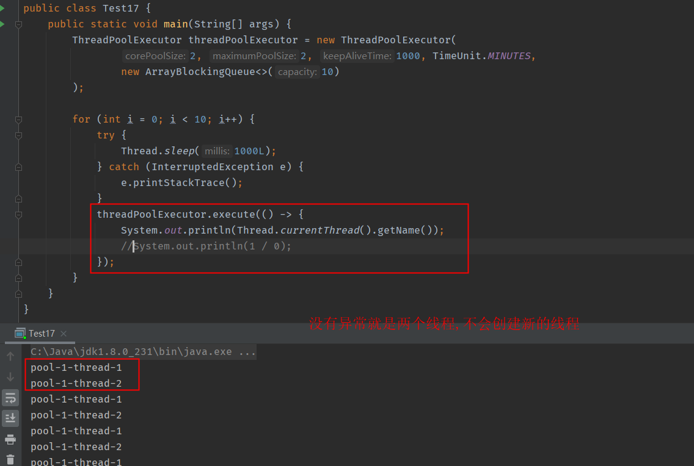
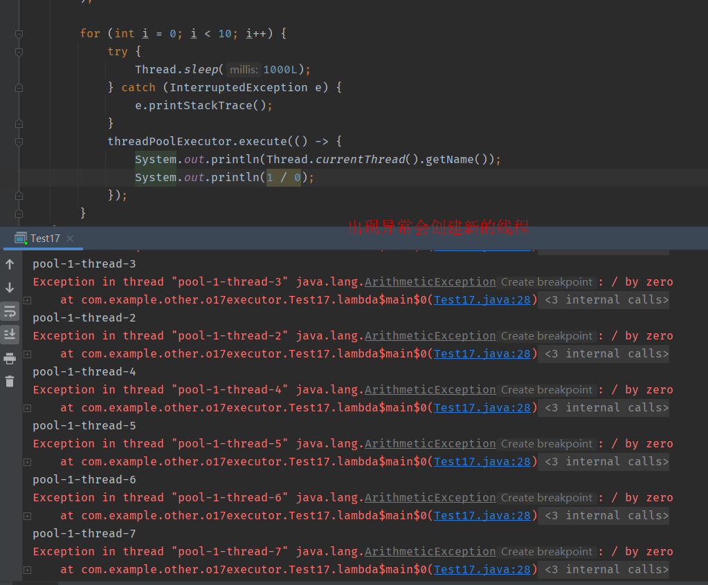

## 线程池是一种生产者 - 消费者模式

目前业界线程池的设计，普遍采用的都是生产者 - 消费者模式。线程池的使用方是生产者，线程池本身是消费者

```java
import java.util.ArrayList;
import java.util.List;
import java.util.concurrent.BlockingQueue;
import java.util.concurrent.LinkedBlockingQueue;

public class MyThreadPool {
    //利用阻塞队列实现生产者-消费者模式
    BlockingQueue<Runnable> wQueue;
    //保存内部工作线程
    List<WorkerThread> threads = new ArrayList<WorkerThread>();

    public MyThreadPool(int size,BlockingQueue<Runnable> wQueue) {
        this.wQueue = wQueue;
        for (int i = 0; i < size; i++) {
            WorkerThread workerThread = new WorkerThread();
            workerThread.start();
            threads.add(workerThread);
        }
    }

    //提交任务
    void execute(Runnable e){
        wQueue.add(e);
    }


    // 工作线程负责消费任务，并执行任务
    class WorkerThread extends Thread {
        public void run() { // 循环取任务并执行
            while (true) {
                Runnable task;
                try {
                    task = wQueue.take();
                    task.run();//执行run方法,并不会创建新的线程,而是在当前的方法执行一个run()方法
                } catch (InterruptedException e) {
                    e.printStackTrace();
                }
            }
        }
    }
    public static void main(String[] args) {
        LinkedBlockingQueue<Runnable> workQueue = new LinkedBlockingQueue<>(12);
        MyThreadPool myThreadPool = new MyThreadPool(10,workQueue);
        for (int i = 0; i <1; i++) {
            myThreadPool.execute(()->{
                System.out.println("hello");
            });
        }
       System.out.println(123);   
    }
}
```


## 如何使用 Java 中的线程池

`ThreadPoolExecutor` 的构造函数

```

ThreadPoolExecutor(
  //表示线程池保有的最小线程数
  int corePoolSize,
  //表示线程池创建的最大线程数
  //当项目很忙时，就需要加人，但是也不能无限制地加，最多就加到 maximumPoolSize 个人。当项目闲下来时，就要撤人了，最多能撤到 corePoolSize 个人。
  int maximumPoolSize,
  //如果一个线程空闲了keepAliveTime & unit这么久，而且线程池的线程数大于 corePoolSize ，那么这个空闲的线程就要被回收了。
  long keepAliveTime,
  TimeUnit unit,
  //工作队列
  BlockingQueue<Runnable> workQueue,
  //通过这个参数你可以自定义如何创建线程，例如你可以给线程指定一个有意义的名字。
  ThreadFactory threadFactory,
  //通过这个参数你可以自定义任务的拒绝策略
  RejectedExecutionHandler handler) 
```

`ThreadPoolExecutor` 已经提供了以下 4 种策略。

- `CallerRunsPolicy`：提交任务的线程自己去执行该任务。
- `AbortPolicy`：默认的拒绝策略，会 throws `RejectedExecutionException`。
- `DiscardPolicy`：直接丢弃任务，没有任何异常抛出。
- `DiscardOldestPolicy`：丢弃最老的任务，其实就是把最早进入工作队列的任务丢弃，然后把新任务加入到工作队列。

## 使用线程池要注意些什么

- 强烈建议使用有界队列。

- 线程池默认的拒绝策略会 throw RejectedExecutionException 这是个运行时异常，对于运行时异常编译器并不强制 catch 它，所以开发人员很容易忽略。因此默认拒绝策略要慎重使用

  - 如果线程池处理的任务非常重要，建议自定义自己的拒绝策略；并且在实际工作中，自定义的拒绝策略往往和降级策略配合使用。

- 使用线程池，还要注意异常处理的问题

  - `ThreadPoolExecutor` 对象的 execute() 方法提交任务时，如果任务在执行的过程中出现运行时异常，会导致执行任务的线程终止；不过，最致命的是任务虽然异常了，但是你却获取不到任何通知(????)，这会让你误以为任务都执行得很正常

  - 虽然线程池提供了很多用于异常处理的方法，但是最稳妥和简单的方案还是捕获所有异常并按需处理，你可以参考下面的示例代码。

    ``` java
    try {
      //业务逻辑
    } catch (RuntimeException x) {
      //按需处理
    } catch (Throwable x) {
      //按需处理
    } 
    ```


关于线程池出现异常的一些尝试

```java
public static void main(String[] args) {
        ThreadPoolExecutor threadPoolExecutor = new ThreadPoolExecutor(
                2, 2, 1000, TimeUnit.MINUTES,
                new ArrayBlockingQueue<>(10)
        );

        for (int i = 0; i < 10; i++) {
            try {
                Thread.sleep(1000L);
            } catch (InterruptedException e) {
                e.printStackTrace();
            }
            threadPoolExecutor.execute(() -> {
                System.out.println(Thread.currentThread().getName());
                //System.out.println(1 / 0);
            });
        }
    }
```


**没有异常**



**出现异常**



异常捕获了，线程就可以复用了


通过submit提交线程(返回的是feature对象.get())可以屏蔽线程中产生的异常，达到线程复用。当get()执行结果时异常才会抛出。

原因是通过submit提交的线程，当发生异常时，会将异常保存，待`future.get();`时才会抛出