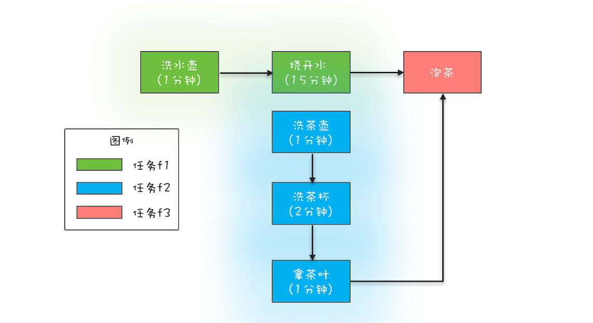

### 如何获取任务执行结果


Java 通过 ThreadPoolExecutor 提供的 3 个 submit() 方法和 1 个 FutureTask 工具类来支持获得任务执行结果的需求。下


```java
// 提交Runnable任务
//这里Future.get()是没有返回值的,只能判断有没有结束任务
Future<?>  submit(Runnable task);  
// 提交Callable任务
// Callable 接口，它只有一个 call() 方法，并且这个方法是有返回值的
<T> Future<T>  submit(Callable<T> task);   
// 提交Runnable任务及结果引用  
//Future.get() 就是获取 T result ,所有可以重写一个Runnable 方法 让他可以 传入T result  就可以修改 result 的结果了
<T> Future<T>  submit(Runnable task, T result); 
```
Future 接口有 5 个方法

```java
// 取消任务
boolean cancel(
  boolean mayInterruptIfRunning);
// 判断任务是否已取消  
boolean isCancelled();
// 判断任务是否已结束
boolean isDone();
// 获得任务执行结果
get();
// 获得任务执行结果，支持超时  两个 get() 方法都是阻塞式的
get(long timeout, TimeUnit unit);
```

- 提交 Callable 任务 submit(Callable task)：这个方法的参数是一个 Callable 接口，它只有一个 call() 方法，并且这个方法是有返回值的，所以这个方法返回的 Future 对象可以通过调用其 get() 方法来获取任务的执行结果。

- 提交 Runnable 任务 submit(Runnable task) ：这个方法的参数是一个 Runnable 接口，Runnable 接口的 run() 方法是没有返回值的，所以 submit(Runnable task) 这个方法返回的 Future 仅可以用来断言任务已经结束了，类似于 Thread.join()。

- 提交 Runnable 任务及结果引用 submit(Runnable task, T result)：这个方法很有意思，假设这个方法返回的 Future 对象是 f，f.get() 的返回值就是传给 submit() 方法的参数 result。这个方法该怎么用呢？下面这段示例代码展示了它的经典用法。需要你注意的是 Runnable 接口的实现类 Task 声明了一个有参构造函数 Task(Result r) ，创建 Task 对象的时候传入了 result 对象，这样就能在类 Task 的 run() 方法中对 result 进行各种操作了。result 相当于主线程和子线程之间的桥梁，通过它主子线程可以共享数据。

```
public class Test23 {

    public static void main(String[] args) {
        ThreadPoolExecutor threadPoolExecutor = new ThreadPoolExecutor(
                2, 4, 5L, TimeUnit.MINUTES,
                new ArrayBlockingQueue<>(5)
        );

        Result r = new Result("zs",18);

        //如果r是 sting 或者是 intger 等 修改值之后 打印出来并没有改变为什么?????
        //  就是因为他们类的修饰符是final 不可变的
        Future<Result> submit = threadPoolExecutor.submit(new Task(r), r);
        try {
            System.out.println(submit.get().getAge()+":"+submit.get().getName());
        } catch (InterruptedException | ExecutionException e) {
            e.printStackTrace();
        }

    }

    static class Task implements Runnable {
        Result r;  //通过构造函数传入result

        Task(Result r) {
            this.r = r;
        }


        @Override
        public void run() {
            System.out.println("Result" + r.getName() + "," + r.getAge());
            r.setAge(99);
            r.setName("ww");
            System.out.println("Result" + r.getName() + "," + r.getAge());
        }
    }
}
```

**FutureTask 工具类**
。前面我们提到的 Future 是一个接口，而 FutureTask 是一个实实在在的工具类
```

FutureTask(Callable<V> callable);
FutureTask(Runnable runnable, V result);
```

FutureTask 实现了 Runnable 和 Future 接口，由于实现了 Runnable 接口，所以可以将 FutureTask 对象作为任务提交给 ThreadPoolExecutor 去执行，也可以直接被 Thread 执行；又因为实现了 Future 接口，所以也能用来获得任务的执行结果

```

// 创建FutureTask
FutureTask<Integer> futureTask = new FutureTask<>(()-> 1+2);
// 创建线程池
ExecutorService es =  Executors.newCachedThreadPool();
// 提交FutureTask 
es.submit(futureTask);
// 获取计算结果
Integer result = futureTask.get();
```
FutureTask 对象直接被 Thread 执行的示例代码如下所示。相信你已经发现了，利用 FutureTask 对象可以很容易获取子线程的执行结果。

```

// 创建FutureTask
FutureTask<Integer> futureTask = new FutureTask<>(()-> 1+2);
// 创建并启动线程
Thread T1 = new Thread(futureTask);
T1.start();
// 获取计算结果
Integer result = futureTask.get();
```



```java

// 创建任务T2的FutureTask
FutureTask<String> ft2
  = new FutureTask<>(new T2Task());
// 创建任务T1的FutureTask
FutureTask<String> ft1
  = new FutureTask<>(new T1Task(ft2));
// 线程T1执行任务ft1
Thread T1 = new Thread(ft1);
T1.start();
// 线程T2执行任务ft2
Thread T2 = new Thread(ft2);
T2.start();
// 等待线程T1执行结果
System.out.println(ft1.get());

// T1Task需要执行的任务：
// 洗水壶、烧开水、泡茶
class T1Task implements Callable<String>{
  FutureTask<String> ft2;
  // T1任务需要T2任务的FutureTask
  T1Task(FutureTask<String> ft2){
    this.ft2 = ft2;
  }
  @Override
  String call() throws Exception {
    System.out.println("T1:洗水壶...");
    TimeUnit.SECONDS.sleep(1);
    
    System.out.println("T1:烧开水...");
    TimeUnit.SECONDS.sleep(15);
    // 获取T2线程的茶叶  
    String tf = ft2.get();
    System.out.println("T1:拿到茶叶:"+tf);

    System.out.println("T1:泡茶...");
    return "上茶:" + tf;
  }
}
// T2Task需要执行的任务:
// 洗茶壶、洗茶杯、拿茶叶
class T2Task implements Callable<String> {
  @Override
  String call() throws Exception {
    System.out.println("T2:洗茶壶...");
    TimeUnit.SECONDS.sleep(1);

    System.out.println("T2:洗茶杯...");
    TimeUnit.SECONDS.sleep(2);

    System.out.println("T2:拿茶叶...");
    TimeUnit.SECONDS.sleep(1);
    return "龙井";
  }
}
// 一次执行结果：
T1:洗水壶...
T2:洗茶壶...
T1:烧开水...
T2:洗茶杯...
T2:拿茶叶...
T1:拿到茶叶:龙井
T1:泡茶...
上茶:龙井
```