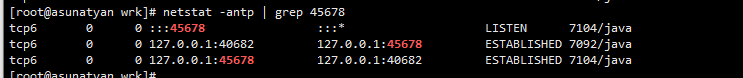
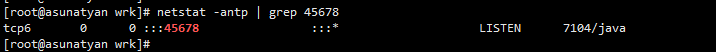

# 注意鉴别客户端 SDK 是否基于连接池

*使用三方客户端进行网络通信时，我们首先要确定客户端` SDK `是否是基于连接池技术实现的*

**TCP 是面向连接的基于字节流的协议：**

- 面向连接，意味着连接需要先创建再使用，创建连接的三次握手有一定开销；
- 基于字节流，意味着字节是发送数据的最小单元，TCP 协议本身无法区分哪几个字节是完整的消息体，也无法感知是否有多个客户端在使用同一个 TCP 连接，TCP 只是一个读写数据的管道。

如果客户端 SDK 没有使用连接池，而直接是 TCP 连接，那么就需要考虑每次建立 TCP 连接的开销，并且因为 TCP 基于字节流，在**多线程的情况下对同一连接进行复用，可能会产生线程安全问题。**  


# 多个springboot Main 

方式1


修改文件


**方式2:**


# 怎么确定连接被复用了

tcpdump port 8916 -i any -s0 -w dump.8916
抓包8916端口，放到dump.8916文件
使用Wireshark来查看文件


除了通过抓包还可以通过



通过tcp连接数也可以查出来有多个连接被复用


ESTABLISHED 连接转态





# 使用jconsole的问题

远程使用改命令启动jar包

```bash
java -Djava.rmi.server.hostname=112.74.47.37 \
-Dcom.sun.management.jmxremote=true \
-Dcom.sun.management.jmxremote.port=8888 \
-Dcom.sun.management.jmxremote.authenticate=false \
-Dcom.sun.management.jmxremote.ssl=false \
-jar java-common-mistakes-0.0.1-SNAPSHOT45678.jar 
```


使用jconsole远程连接


进行抓包

除了8888连接端口没有其他的端口连接就是连接不上


阿里云放开所有的端口可以连接,然后进行抓包发现有两个端口


然后再配置这一个端口就行


