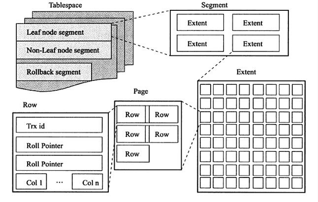
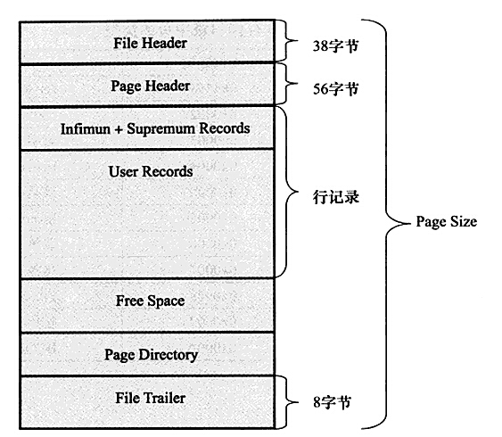
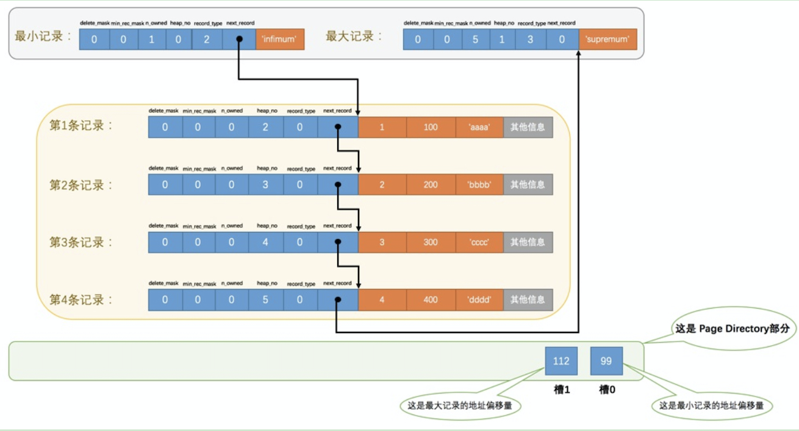
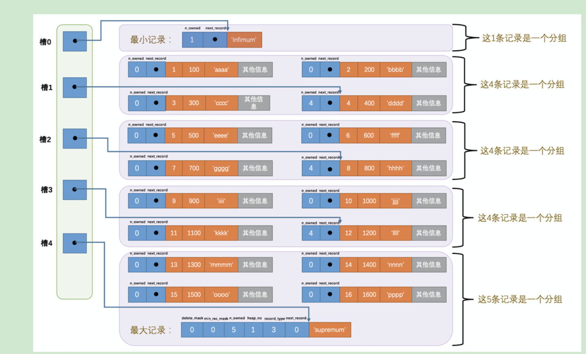
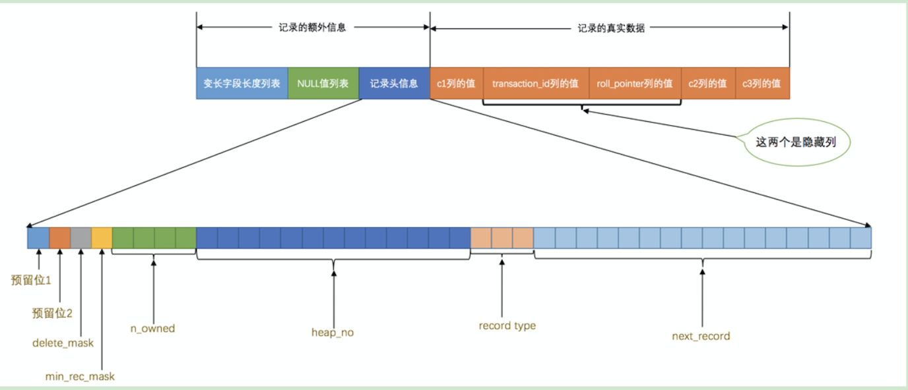
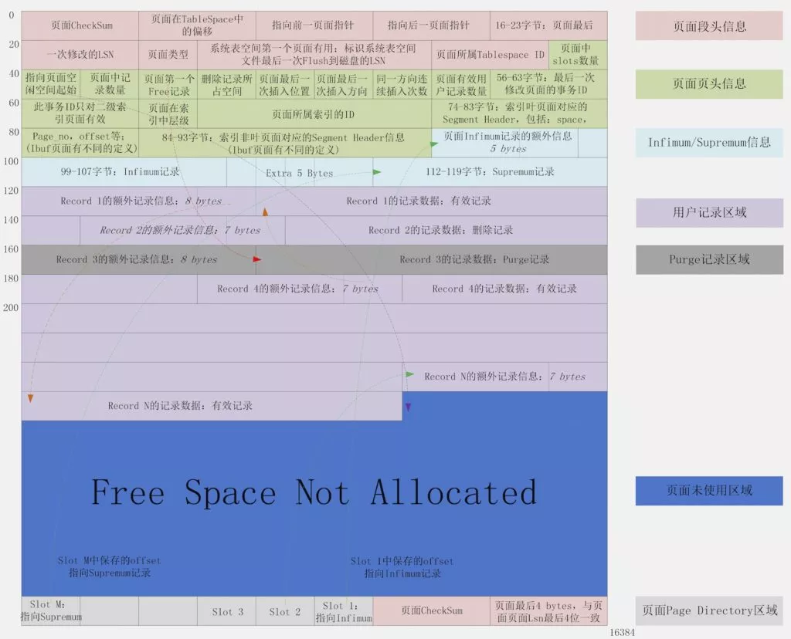

# mysql数据页结构

常见的页类型有数据页、Undo 页、系统页、事务数据页等，本文主要分析的是数据页。默认的页大小为`16KB`，每个页中至少存储有 2 条或以上的行记录

## Page 结构

上图为 Page 数据结构，File Header 字段用于记录 Page 的头信息，其中比较重要的是 `FIL_PAGE_PREV `和 `FIL_PAGE_NEXT` 字段，通过这两个字段，我们可以找到该页的上一页和下一页，实际上所有页通过两个字段可以形成一条双向链表。Page Header 字段用于记录 Page 的状态信息。

接下来的` Infimum `和 `Supremum `是两个伪行记录，

- `Infimum`（下确界）记录比该页中任何主键值都要小的值，
- `supremum` （上确界）记录比该页中任何主键值都要大的值，这个伪记录分别构成了页中记录的边界。

B+树的叶子节点是page （页），一个页里面可以存多个行

## 参考

https://www.cnblogs.com/sicheng-li/p/13112306.html

## page_directory(页目录)

 将每个组的最大heap_no的记录偏移地址存在page_directory，这样查找的时候，就可以通过page_directory二分查找，然后再进入相应的组中找

heap_no：记录的序号，序号为0的记录是infimum，序号1为spuermum（这俩是mysql为我们自动提供的），所以我们自己的都是从2开始的，这个排序是通过主键的比较规则来的

页目录用来存储每组最后一条记录的地址偏移量，这些地址偏移量会按照先后顺序存储起来，每组的地址偏移量也被称之为槽(slot)，每个槽相当于指针指向了不同组的最后一个记录。如下图所示：

## b+tree 叶子节点

## Page完整的结构图

## 总结

1. InnoDB为了不同的目的设计了不同类型的页，我们把用于存放记录的页叫做数据页
2. 一个数据页可以被大致分为7个部分，分别是：
   1. File Header：表示页的一些通用信息，占固定的38字节
   2. Page Header：表示数据页专有的一些信息，占固定的56个字节
   3. Infimum + Supremum：两个虚拟的伪记录，分别表示页中的最小和最大记录，占固定的26个字节
   4. User Records：真实存储我们插入的记录的部分，大小不固定
   5. Free Space：页中尚未使用的部分，大小不确定
   6. Page Directory：页中的某些记录相对位置，也就是各个槽在页面中的地址偏移量，大小不固定，插入的记录越多，这个部分占用的空间越多
   7. File Trailer：用于检验页是否完整的部分，占用固定的8个字节
3. 每个记录的头信息中都有一个next_record属性，从而使页中的所有记录串联一个单链表
4. InnoDB会为把页中的记录划分为若干个组，每个组的最后一个记录的地址偏移量作为一个槽，存放在Page_Directory中，所以在一个页中根据主键查找记录是非常快的，分为两步：
   1. 通过二分法确定槽
   2. 通过记录的next_record属性遍历该槽所在的组中的各个记录
5. 每个数据页的File Header 部分都有上一个和下一个页的编号，所以所有的数据页会组成一个双链表
6. 为保证从内存中同步到磁盘的页的完整性，在页的首部和尾部都会存储页中数据的校验和和页面最后修改时对应的LSN值，如果首部和尾部的校验和和LSN值校验不成功的话，就说名同步失败了。