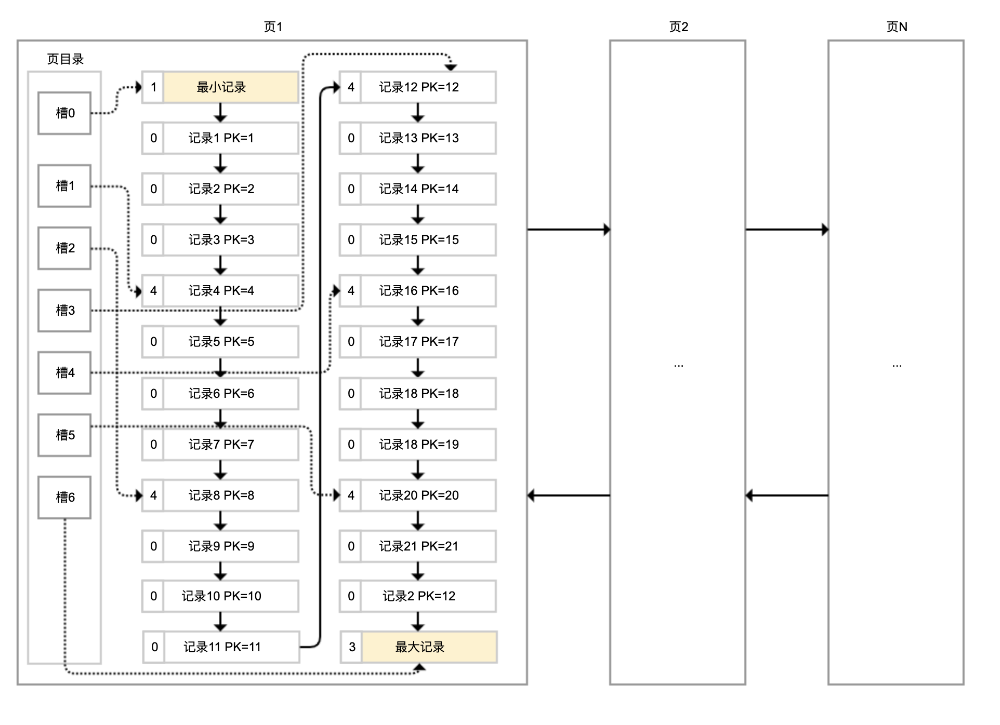
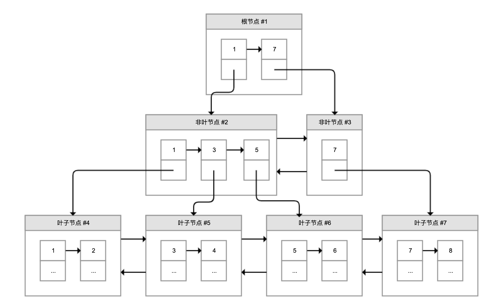
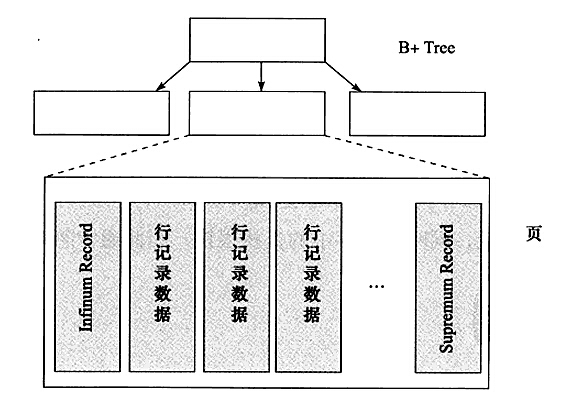
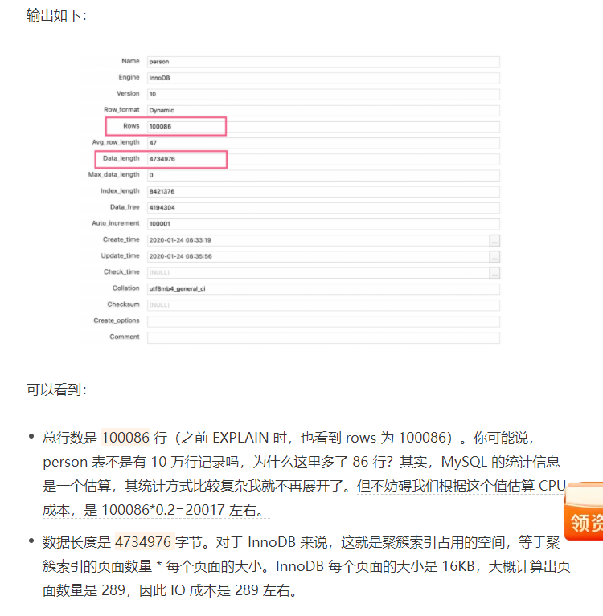
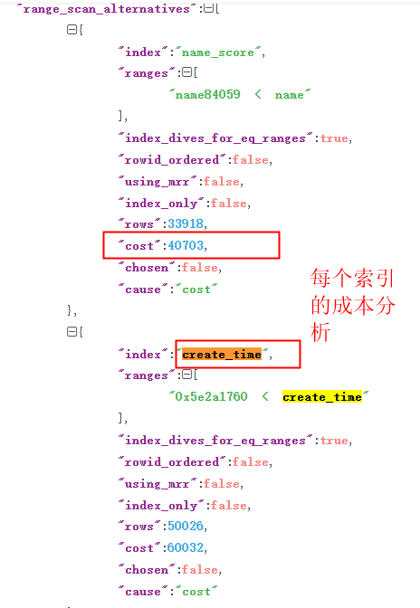

# InnoDB 是如何存储数据的？


各个数据页组成一个双向链表，每个数据页中的记录按照主键顺序组成单向链表；每一个数据页中有一个页目录，方便按照主键查询记录。数据页的结构如下：



页目录通过槽把记录分成不同的小组，每个小组有若干条记录。

如图所示，**记录中最前面的小方块中的数字**(比如槽位0,小方块显示的是1,那么就是一条记录,再比如:槽位5,最前面的是记录20,小方块是4代表是这个槽位有4个记录,重下往上)，代表的是当前分组的记录条数，最小和最大的槽指向 2 个特殊的伪记录。

有了槽之后，我们按照主键搜索页中记录时，就可以采用二分法快速搜索，无需从最小记录开始遍历整个页中的记录链表。

# 聚簇索引和二级索引



我们再看看 B+ 树如何实现快速查找主键。比如，我们要搜索 PK=4 的数据，通过根节点中的索引可以知道数据在第一个记录指向的 2 号页中，通过 2 号页的索引又可以知道数据在 5 号页，5 号页就是实际的数据页，然后再通过二分法查找页目录马上可以找到记录的指针。


怎么理解上面这句话

- 先看下图

- 一个数据页有多行记录,对应上图的叶子结点,
  - 比如上图的叶子结点#4,那么行记录的数据就对应到了结点里面的数据1,2等




# 索引选择成本分析

其实，MySQL 在查询数据之前，会先对可能的方案做执行计划，然后依据成本决定走哪个执行计划。


这里的成本，包括 IO 成本和 CPU 成本：

- IO 成本，是从磁盘把数据加载到内存的成本。默认情况下，读取数据页的 IO 成本常数是 1（也就是读取 1 个页成本是 1）。
- CPU 成本，是检测数据是否满足条件和排序等 CPU 操作的成本。默认情况下，检测记录的成本是 0.2。



也通过 EXPLAIN 知道了优化器最终会选择怎样的执行计划，但 MySQL 如何制定执行计划始终是一个黑盒。那么，有没有什么办法可以了解各种执行计划的成本，以及 MySQL 做出选择的依据呢


```sql
SET optimizer_trace="enabled=on";
SELECT * FROM person WHERE NAME >'name84059' AND create_time>'2020-01-24 06:00:00';
SELECT * FROM information_schema.OPTIMIZER_TRACE;
SET optimizer_trace="enabled=off";
```


在 MySQL 5.6 及之后的版本中，我们可以使用 optimizer trace 功能查看优化器生成执行计划的整个过程




