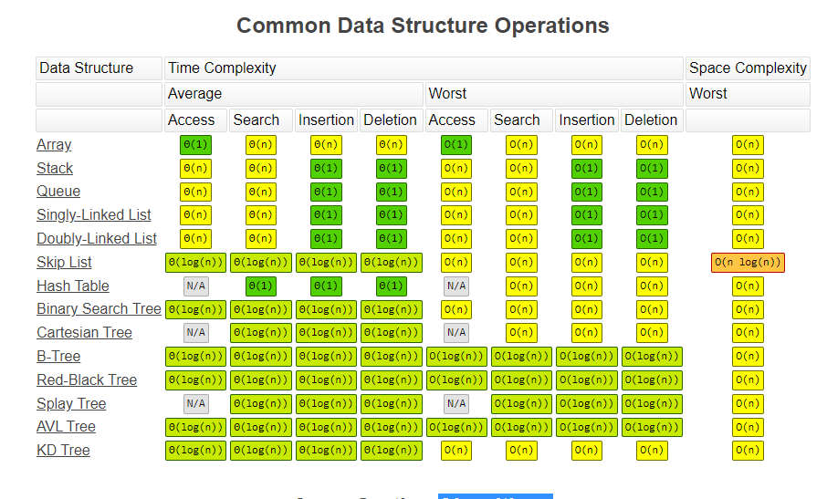

## 一定要让合适的数据结构做合适的事情

 要对大 List 进行单值搜索的话，可以考虑使用 HashMap，其中 Key 是要搜索的值，Value 是原始对象，会比使用 ArrayList 有非常明显的性能优势。

但是 使用 ObjectSizeCalculator 工具打印 ArrayList 和 HashMap 的内存占用，可以看到 ArrayList 占用内存 21M，而 HashMap 占用的内存达到了 72M，是 List 的三倍多


### 第二个误区是，过于迷信教科书的大 O 时间复杂度。

在随机访问方面，我们看到了 ArrayList 的绝对优势，耗时只有 11 毫秒，而 LinkedList 耗时 6.6 秒，这符合上面我们所说的时间复杂度；但，随机插入操作居然也是 LinkedList 落败，耗时 9.3 秒，ArrayList 只要 1.5 秒：


翻看 LinkedList 源码发现，插入操作的时间复杂度是 O(1) 的前提是，你已经有了那个要插入节点的指针。但，在实现的时候，我们需要先通过循环获取到那个节点的 Node，然后再执行插入操作。前者也是有开销的，不可能只考虑插入操作本身的代价：

```java

public void add(int index, E element) {
    checkPositionIndex(index);

    if (index == size)
        linkLast(element);
    else
        //node(index) 获取index的指针,需要耗时,除非是插入到首尾才不需要去查询
        linkBefore(element, node(index));
}

Node<E> node(int index) {
    // assert isElementIndex(index);

    if (index < (size >> 1)) {
        Node<E> x = first;
        for (int i = 0; i < index; i++)
            x = x.next;
        return x;
    } else {
        Node<E> x = last;
        for (int i = size - 1; i > index; i--)
            x = x.prev;
        return x;
    }
}
```

调用类型是 Integer 的 ArrayList 的 remove 方法删除元素，传入一个 Integer 包装类的数字和传入一个 int 基本类型的数字，结果一样吗？

int类型是index，也就是索引，是按照元素位置删除的；Integer是删除某个元素，内部是通过遍历数组然后对比，找到指定的元素，然后删除；两个都需要进行数组拷贝，是通过System.arraycopy进行的


常用数据结构的时间复杂度 https://www.bigocheatsheet.com/



| Data Structure                               | 新增              | **查询/Find** | 删除/Delete | GetByIndex |
| -------------------------------------------- | ----------------- | ------------- | ----------- | ---------- |
| 数组  Array (T[])                            | O(n)              | **O(n)**      | O(n)        | O(1)       |
| 链表 Linked list (LinkedList<T>)             | O(1)  jdk这里有坑 | **O(n)**      | O(n)        | O(n)       |
| Resizable array list (List<T>)               | O(1)              | **O(n)**      | O(n)        | O(1)       |
| Stack (Stack<T>)                             | O(1)              | **-**         | O(1)        | -          |
| Queue (Queue<T>)                             | O(1)              | **-**         | O(1)        | -          |
| Hash table (Dictionary<K,T>)                 | O(1)              | **O(1)**      | O(1)        | -          |
| Tree-based dictionary(SortedDictionary<K,T>) | O(log n)          | **O(log n)**  | O(log n)    | -          |
| Hash table based set (HashSet<T>)            | O(1)              | **O(1)**      | O(1)        | -          |
| Tree based set (SortedSet<T>)                | O(log n)          | **O(log n)**  | O(log n)    | -          |


## 使用 Arrays.asList 把数据转换为 List 的三个坑

- 不能直接使用 Arrays.asList 来转换基本类型数组
  - 会把基本类型的数组当成一个对象,数组里面就是这个对象
  - 使用 Arrays.stream 方法来转换 ,或者把list改成包装类型
    - Arrays.stream(arr1).boxed().collect(Collectors.toList());
- Arrays.asList 返回的 List 不支持增删操作
  - 返回的list是arrays类里面的list
- 对原始数组的修改会影响到我们获得的那个 List
  - 修复方式比较简单，重新 new 一个 ArrayList 初始化 Arrays.asList 返回的 List 即可

## 使用 List.subList 进行切片操作居然会导致 OOM？

```java

private static List<List<Integer>> data = new ArrayList<>();

private static void oom() {
    for (int i = 0; i < 1000; i++) {
        List<Integer> rawList = IntStream.rangeClosed(1, 100000).boxed().collect(Collectors.toList());
        data.add(rawList.subList(0, 1));
    }
}
```

出现 OOM 的原因是，循环中的 1000 个具有 10 万个元素的 List 始终得不到回收，因为它始终被 subList 方法返

回的 List 强引用,并且数据共享


```java

List<Integer> list = IntStream.rangeClosed(1, 10).boxed().collect(Collectors.toList());
List<Integer> subList = list.subList(1, 4);
System.out.println(subList);
subList.remove(1);
System.out.println(list);
list.add(0);
try {
    subList.forEach(System.out::println);
} catch (Exception ex) {
    ex.printStackTrace();
}
```


```java

public class ArrayList<E> extends AbstractList<E>
        implements List<E>, RandomAccess, Cloneable, java.io.Serializable
{
    protected transient int modCount = 0;
  private void ensureExplicitCapacity(int minCapacity) {
        modCount++;
        // overflow-conscious code
        if (minCapacity - elementData.length > 0)
            grow(minCapacity);
    }
  public void add(int index, E element) {
    rangeCheckForAdd(index);

    ensureCapacityInternal(size + 1);  // Increments modCount!!
    System.arraycopy(elementData, index, elementData, index + 1,
                     size - index);
    elementData[index] = element;
    size++;
  }

  public List<E> subList(int fromIndex, int toIndex) {
    subListRangeCheck(fromIndex, toIndex, size);
    //传入this 子类构造强引用,且修改会影响父类
    return new SubList(this, offset, fromIndex, toIndex);
  }

  private class SubList extends AbstractList<E> implements RandomAccess {
    private final AbstractList<E> parent;
    private final int parentOffset;
    private final int offset;
    int size;

    SubList(AbstractList<E> parent,
          int offset, int fromIndex, int toIndex) {
        this.parent = parent;
        this.parentOffset = fromIndex;
        this.offset = offset + fromIndex;
        this.size = toIndex - fromIndex;
        //this指的是内部内,ArrayList.this是指外部类
        this.modCount = ArrayList.this.modCount;
    }

        public E set(int index, E element) {
            rangeCheck(index);
            checkForComodification();
            return l.set(index+offset, element);
        }

    public ListIterator<E> listIterator(final int index) {
                checkForComodification();
                ...
    }

    private void checkForComodification() {
        if (ArrayList.this.modCount != this.modCount)
            throw new ConcurrentModificationException();
    }
    ...
  }
}
```


```

[2, 3, 4]
[1, 2, 4, 5, 6, 7, 8, 9, 10]
java.util.ConcurrentModificationException
  at java.util.ArrayList$SubList.checkForComodification(ArrayList.java:1239)
  at java.util.ArrayList$SubList.listIterator(ArrayList.java:1099)
  at java.util.AbstractList.listIterator(AbstractList.java:299)
  at java.util.ArrayList$SubList.iterator(ArrayList.java:1095)
  at java.lang.Iterable.forEach(Iterable.java:74)
```

- ArrayList 维护了一个叫作 modCount 的字段，表示集合结构性修改的次数。所谓结构性修改，指的是影响 List 大小的修改，所以 add 操作必然会改变 modCount 的值。
- ，分析第 21 到 24 行的 subList 方法可以看到，获得的 List 其实是内部类 SubList，并不是普通的 ArrayList，在初始化的时候传入了 this。
- 分析第 26 到 39 行代码可以发现，这个 SubList 中的 parent 字段就是原始的 List。SubList 初始化的时候，并没有把原始 List 中的元素复制到独立的变量中保存。我们可以认为 SubList 是原始 List 的视图，并不是独立的 List。双方对元素的修改会相互影响，而且 SubList 强引用了原始的 List，所以大量保存这样的 SubList 会导致 OOM。
- 分析第 47 到 55 行代码可以发现，遍历 SubList 的时候会先获得迭代器，比较原始 ArrayList modCount 的值和 SubList 当前 modCount 的值。获得了 SubList 后，我们为原始 List 新增了一个元素修改了其 modCount，所以判等失败抛出 ConcurrentModificationException 异常。

修复方式有两种：

- 一种是，不直接使用 subList 方法返回的 SubList，而是重新使用 new ArrayList，在构造方法传入 SubList，来构建一个独立的 ArrayList；
- 另一种是，对于 Java 8 使用 Stream 的 skip 和 limit API 来跳过流中的元素，以及限制流中元素的个数，同样可以达到 SubList 切片的目的。


