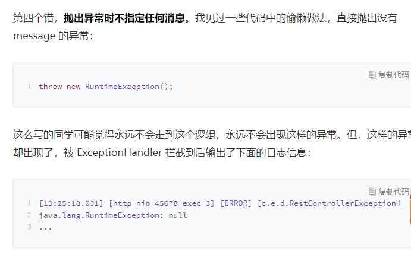
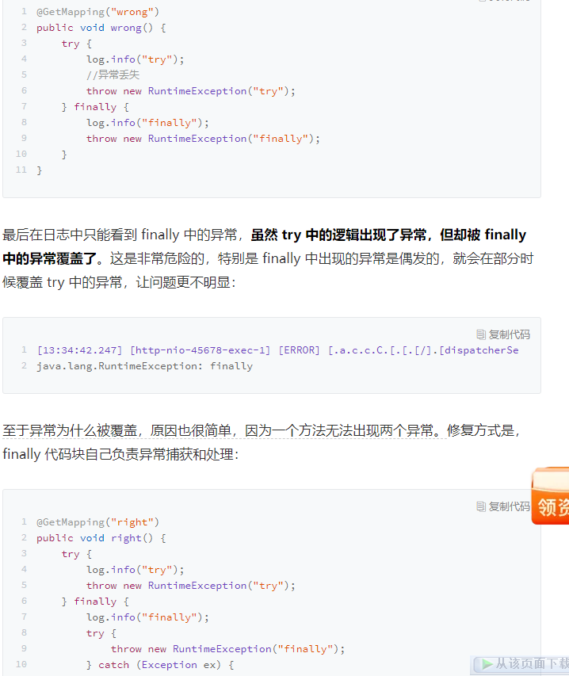

### 4：RestControllerAdvice来捕获全局异常，

@RestControllerAdvice都是对Controller进行增强的，可以全局捕获spring mvc抛的异常。
 @ExceptionHandler(value = Exception.class)
 ExceptionHandler的作用是用来捕获指定的异常。


RestControllerAdvice = ControllerAdvice + ResponseBody


```java
@RestControllerAdvice
@Slf4j
public class RestControllerExceptionHandler {

    private static int GENERIC_SERVER_ERROR_CODE = 2000;
    private static String GENERIC_SERVER_ERROR_MESSAGE = "服务器忙，请稍后再试";

    @ExceptionHandler//(BusinessException.class),指定那个异常
    public APIResponse handle(HttpServletRequest req, HandlerMethod method, Exception ex) {
        if (ex instanceof BusinessException) {
            BusinessException exception = (BusinessException) ex;
            log.warn(String.format("访问 %s -> %s 出现业务异常!!！", req.getRequestURI(), method.toString()), ex);
            return new APIResponse(false, null, exception.getCode(), exception.getMessage());
        } else {
            log.error(String.format("访问 %s -> %s 出现系统异常！", req.getRequestURI(), method.toString()), ex);
            return new APIResponse(false, null, GENERIC_SERVER_ERROR_CODE, GENERIC_SERVER_ERROR_MESSAGE);
        }
    }
}
```


## 异常处理

我不建议在框架层面进行异常的自动、统一处理，尤其不要随意捕获异常。但，框架可以做兜底工作。如果异常上升到最上层逻辑还是无法处理的话，可以以统一的方式进行异常转换，比如通过 @RestControllerAdvice + @ExceptionHandler，来捕获这些“未处理”异常：

- 对于自定义的业务异常，以 Warn 级别的日志记录异常以及当前 URL、执行方法等信息后，提取异常中的错误码和消息等信息，转换为合适的 API 包装体返回给 API 调用方；
- 对于无法处理的系统异常，以 Error 级别的日志记录异常和上下文信息（比如 URL、参数、用户 ID）后，转换为普适的“服务器忙，请稍后再试”异常信息，同样以 API 包装体返回给调用方


处理方式可以参考如下两种,exception一定不要吞掉,e一定要打印出来

```java

catch (IOException e) {
    log.error("文件读取错误", e);
    throw new RuntimeException("系统忙请稍后再试");
}


catch (IOException e) {
    throw new RuntimeException("系统忙请稍后再试", e);
}
```


这里很坑的




总之，如果你捕获了异常打算处理的话，除了通过日志正确记录异常原始信息外，通常还有三种处理模式：

- 转换，即转换新的异常抛出。对于新抛出的异常，最好具有特定的分类和明确的异常消息，而不是随便抛一个无关或没有任何信息的异常，并最好通过 cause 关联老异常。
- 重试，即重试之前的操作。比如远程调用服务端过载超时的情况，盲目重试会让问题更严重，需要考虑当前情况是否适合重试
- 恢复，即尝试进行降级处理，或使用默认值来替代原始数据。以上，就是通过 catch 捕获处理异常的一些最佳实践。

## 小心 finally 中的异常




或者可以把 try 中的异常作为主异常抛出，使用 addSuppressed 方法把 finally 中的异常附加到主异常上：

```java

@GetMapping("right2")
public void right2() throws Exception {
    Exception e = null;
    try {
        log.info("try");
        throw new RuntimeException("try");
    } catch (Exception ex) {
        e = ex;
    } finally {
        log.info("finally");
        try {
            throw new RuntimeException("finally");
        } catch (Exception ex) {
            if (e!= null) {
                e.addSuppressed(ex);
            } else {
                e = ex;
            }
        }
    }
    throw e;
}
```


## 线程池异常处理

- 因为异常的抛出老线程退出了，线程池只能重新创建一个线程
- ThreadGroup 帮我们进行了未捕获异常的默认处理,没有以统一的错误日志格式记录错误信息打印出来的形式，对生产级代码是不合适的

修复方式有 2 步：

1. 以 execute 方法提交到线程池的异步任务，最好在任务内部做好异常处理；
2. 设置自定义的异常处理程序作为保底，比如在声明线程池时自定义线程池的未捕获异常处理程序：

```java

new ThreadFactoryBuilder()
  .setNameFormat(prefix+"%d")
  .setUncaughtExceptionHandler((thread, throwable)-> log.error("ThreadPool {} got exception", thread, throwable))
  .get()
```

或者设置全局的默认未捕获异常处理程序：

```java
static {
    Thread.setDefaultUncaughtExceptionHandler((thread, throwable)-> log.error("Thread {} got exception", thread, throwable));
}
```


