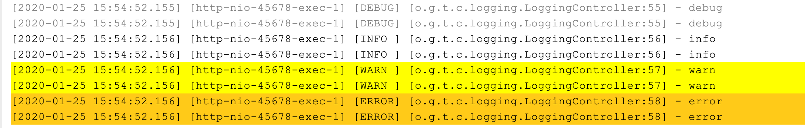
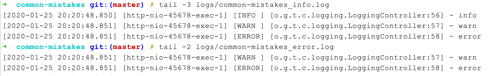

https://blog.csdn.net/foreverling/article/details/51385128

https://zhuanlan.zhihu.com/p/355103232


# 配置问题

## Logger和root

Logger的appender根据参数additivity决定是否要叠加root的appender，logger的级别是其自身定义的级别，和root的级别没什么关系。

```xml

<?xml version="1.0" encoding="UTF-8" ?>
<configuration>
    <appender name="CONSOLE" class="ch.qos.logback.core.ConsoleAppender">
        <layout class="ch.qos.logback.classic.PatternLayout">
            <pattern>[%d{yyyy-MM-dd HH:mm:ss.SSS}] [%thread] [%-5level] [%logger{40}:%line] - %msg%n</pattern>
        </layout>
    </appender>
    <logger name="org.geekbang.time.commonmistakes.logging" level="DEBUG">
        <appender-ref ref="CONSOLE"/>
    </logger>
    <root level="INFO">
        <appender-ref ref="CONSOLE"/>
    </root>
</configuration>
```



由于我们定义的` <logger> `继承自` <root>`，所以同一条日志既会通过 logger 记录，也会发送到 root 记录，因此应用 package 下的日志出现了重复记录。


解决办法:可以设置` <logger>` 的 additivity 属性为 false，这样就不会继承 <root> 的 Appender 了：


## LevelFilter 配置

```xml

<?xml version="1.0" encoding="UTF-8" ?>
<configuration>
   <property name="logDir" value="./logs" />
   <property name="app.name" value="common-mistakes" />
   <appender name="CONSOLE" class="ch.qos.logback.core.ConsoleAppender">
      <layout class="ch.qos.logback.classic.PatternLayout">
         <pattern>
             [%d{yyyy-MM-dd HH:mm:ss.SSS}] [%thread] [%-5level] [%logger{40}:%line] - %msg%n
          </pattern>
      </layout>
   </appender>
    
   <appender name="INFO_FILE" class="ch.qos.logback.core.FileAppender">
      <File>${logDir}/${app.name}_info.log</File>
       <!- 定义的 LevelFilter 过滤日志，将过滤级别设置为 INFO，目的是希望 _info.log 文件中可以记录 INFO 级别的日志。-->
      <filter class="ch.qos.logback.classic.filter.LevelFilter">
         <level>INFO</level>
      </filter>
      <encoder class="ch.qos.logback.classic.encoder.PatternLayoutEncoder">
         <pattern>
             [%d{yyyy-MM-dd HH:mm:ss.SSS}] [%thread] [%-5level] [%logger{40}:%line] - %msg%n
          </pattern>
         <charset>UTF-8</charset>
      </encoder>
   </appender>
    
   <appender name="ERROR_FILE" class="ch.qos.logback.core.FileAppender">
      <File>${logDir}/${app.name}_error.log</File>
       <!--使用 ThresholdFilter 来过滤日志，过滤级别设置为 WARN-->
      <filter class="ch.qos.logback.classic.filter.ThresholdFilter">
         <level>WARN</level>
      </filter>
      <encoder class="ch.qos.logback.classic.encoder.PatternLayoutEncoder">
         <pattern>
             [%d{yyyy-MM-dd HH:mm:ss.SSS}] [%thread] [%-5level] [%logger{40}:%line] - %msg%n</pattern>
         <charset>UTF-8</charset>
      </encoder>
   </appender>
    
   <root level="INFO">
      <appender-ref ref="CONSOLE" />
      <appender-ref ref="INFO_FILE"/>
      <appender-ref ref="ERROR_FILE"/>
   </root>
</configuration>
```




可以看到，

_info.log 中包含了 INFO、WARN 和 ERROR 三个级别的日志，不符合我们的预期；

error.log 包含了 WARN 和 ERROR 两个级别的日志。因此，造成了日志的重复收集。


**<filter>:**

过滤器，执行一个过滤器会有返回个枚举值，即DENY，NEUTRAL，ACCEPT其中之一。返回DENY，日志将立即被抛弃不再经过其他过滤器；返回NEUTRAL，有序列表里的下个过滤器过接着处理日志；返回ACCEPT，日志会被立即处理，不再经过剩余过滤器。

过滤器被添加到**<Appender>** 中，为**<Appender>** 添加一个或多个过滤器后，可以用任意条件对日志进行过滤。**<Appender>** 有多个过滤器时，按照配置顺序执行。

 

下面是几个常用的过滤器：

 

**LevelFilter：** 级别过滤器，根据日志级别进行过滤。如果日志级别等于配置级别，过滤器会根据onMath 和 onMismatch接收或拒绝日志。有以下子节点：

<level>:设置过滤级别

<onMatch>:用于配置符合过滤条件的操作

<onMismatch>:用于配置不符合过滤条件的操作


 和 ThresholdFilter 不同的是，LevelFilter 仅仅配置 level 是无法真正起作用的。由于没有配置 onMatch 和 onMismatch 属性，所以相当于这个过滤器是无用的，导致 INFO 以上级别的日志都记录了。

配置 LevelFilter 的 onMatch 属性为 ACCEPT，表示接收 INFO 级别的日志；配置 onMismatch 属性为 DENY，表示除了 INFO 级别都不记录：这样修改后，_info.log 文件中只会有 INFO 级别的日志，不会出现日志重复的问题了。

例如：将过滤器的日志级别配置为INFO，所有INFO级别的日志交给appender处理，非INFO级别的日志，被过滤掉。

```
<configuration>   
  <appender name="CONSOLE" class="ch.qos.logback.core.ConsoleAppender">   
    <filter class="ch.qos.logback.classic.filter.LevelFilter">   
      <level>INFO</level>   
      <onMatch>ACCEPT</onMatch>   
      <onMismatch>DENY</onMismatch>   
    </filter>   
    <encoder>   
      <pattern>   
        %-4relative [%thread] %-5level %logger{30} - %msg%n   
      </pattern>   
    </encoder>   
  </appender>   
  <root level="DEBUG">   
    <appender-ref ref="CONSOLE" />   
  </root>   
</configuration>  
```

**ThresholdFilter：** 临界值过滤器，过滤掉低于指定临界值的日志。

当日志级别大于等于配置的级别时返回 NEUTRAL，继续调用过滤器链上的下一个过滤器；否则，返回 DENY 直接拒绝记录日志：

例如：过滤掉所有低于INFO级别的日志。


```
<configuration>   
  <appender name="CONSOLE"   
    class="ch.qos.logback.core.ConsoleAppender">   
    <!-- 过滤掉 TRACE 和 DEBUG 级别的日志-->   
    <filter class="ch.qos.logback.classic.filter.ThresholdFilter">   
      <level>INFO</level>   
    </filter>   
    <encoder>   
      <pattern>   
        %-4relative [%thread] %-5level %logger{30} - %msg%n   
      </pattern>   
    </encoder>   
  </appender>   
  <root level="DEBUG">   
    <appender-ref ref="CONSOLE" />   
  </root>   
</configuration>  
```


