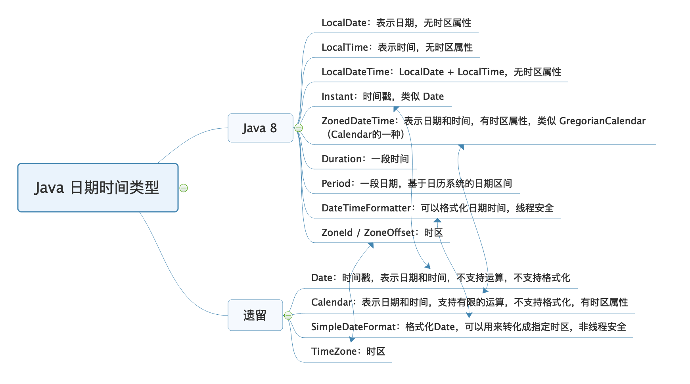

## 时区划分方法
地球是自西向东自转，东边比西边先看到太阳，东边的时间也比西边的早。东边时刻与西边时刻的差值不仅要以时计，而且还要以分和秒来计算，这给人们带来不便。
为了克服时间上的混乱，1884年在华盛顿召开的一次国际经度会议（又称国际子午线会议）上，规定将全球划分为24个时区（东、西各12个时区）。规定英国（格林尼治天文台旧址）为中时区（零时区）、东1—12区，西1—12区。每个时区横跨经度15度，时间正好是1小时。最后的东、西第12区各跨经度7.5度，以东、西经180度为界。每个时区的中央经线上的时间就是这个时区内统一采用的时间，称为区时，相邻两个时区的时间相差1小时。
例如，中国东8区的时间总比泰国东7区的时间早1小时，而比日本东9区的时间晚1小时。因此，出国旅行的人，必须随时调整自己的手表，才能和当地时间相一致。凡向西走，每过一个时区，就要把表拨慢1小时（比如2点拨到1点）；凡向东走，每过一个时区，就要把表拨快1小时（比如1点拨到2点）。并且规定英国（格林尼治天文台旧址）为本初子午线，即零度经线。


## 初始化日期时间

如果要初始化一个 2019 年 12 月 31 日 11 点 12 分 13 秒这样的时间

```java
//年应该是和 1900 的差值，月应该是从 0 到 11 而不是从 1 到 12。
//12月也可以用 Calendar.DECEMBER
Date date = new Date(2019 - 1900, 11, 31, 11, 12, 13);

```

有国际化需求时，需要使用 Calendar 类来初始化时间

```java
Calendar calendar = Calendar.getInstance();
calendar.set(2019, 11, 31, 11, 12, 13);
System.out.println(calendar.getTime());

Calendar calendar2 = Calendar.getInstance(TimeZone.getTimeZone("America/New_York"));
calendar2.set(2019, Calendar.DECEMBER, 31, 11, 12, 13);
System.out.println(calendar2.getTime());

//==控制台
Tue Dec 31 11:12:13 CST 2019
Wed Jan 01 00:12:13 CST 2020
```


## 时区问题

- Date 并无时区问题，世界上任何一台计算机使用 new Date() 初始化得到的时间都一样。因为，Date 中保存的是 UTC 时间，UTC 是以原子钟为基础的统一时间，不以太阳参照计时，并无时区划分。

- 二是，Date 中保存的是一个时间戳，代表的是从 1970 年 1 月 1 日 0 点（Epoch 时间）到现在的毫秒数。尝试输出 Date(0)：


## 类
### Date 类
- 一是，Date 并无时区问题，世界上任何一台计算机使用 new Date() 初始化得到的时间都一样。因为，Date 中保存的是 UTC 时间，UTC 是以原子钟为基础的统一时间，不以太阳参照计时，并无时区划分。
- 二是，Date 中保存的是一个时间戳，代表的是从 1970 年 1 月 1 日 0 点（Epoch 时间）到现在的毫秒数。尝试输出 Date(0)：

```java
        Date date = new Date(0);
        System.out.println(date);
        Date date1 = new Date(2021-1900,11,31,0,0,0);
        System.out.println(date1);
```
```
Thu Jan 01 08:00:00 CST 1970
Fri Dec 31 00:00:00 CST 2021
```


### Class ZoneId
|   Modifier and Type      |      Method         |      Description |
| -------- | ------------------ | ----------------- |
| static ZoneId | `systemDefault() | `获取系统默认时区。 |
| static Set<String> |	getAvailableZoneIds() | 获取一组可用的区域ID。|

### Class TimeZone

TimeZone表示时区偏移量，也可以显示夏令时。

|   Modifier and Type      |      Method         |      Description |
| -------- | ------------------ | ----------------- |
| static String[] |	getAvailableIDs() | 获取支持的所有可用ID。|
| static TimeZone |	getTimeZone(String ID) | 获取给定ID的 TimeZone 。|
| static TimeZone |	getTimeZone(ZoneId zoneId)| 获取 TimeZone对于给定 zoneId 。|

```java
String stringDate = "2020-01-02 22:00:00";
SimpleDateFormat inputFormat = new SimpleDateFormat("yyyy-MM-dd HH:mm:ss");
//默认时区解析时间表示
Date date1 = inputFormat.parse(stringDate);
System.out.println(date1 + ":" + date1.getTime());
//纽约时区解析时间表示
inputFormat.setTimeZone(TimeZone.getTimeZone("America/New_York"));
Date date2 = inputFormat.parse(stringDate);
System.out.println(date2 + ":" + date2.getTime());
```
```
Thu Jan 02 22:00:00 CST 2020:1577973600000
Fri Jan 03 11:00:00 CST 2020:1578020400000
```


时区
```
String stringDate = "2020-01-02 22:00:00";
SimpleDateFormat inputFormat = new SimpleDateFormat("yyyy-MM-dd HH:mm:ss");
//同一Date
Date date = inputFormat.parse(stringDate);
//默认时区格式化输出：
System.out.println(new SimpleDateFormat("[yyyy-MM-dd HH:mm:ss Z]").format(date));
//纽约时区格式化输出
TimeZone.setDefault(TimeZone.getTimeZone("America/New_York"));
System.out.println(new SimpleDateFormat("[yyyy-MM-dd HH:mm:ss Z]").format(date));
```

```
[2020-01-02 22:00:00 +0800]
[2020-01-02 09:00:00 -0500]
```

```java

System.out.println("right");

String stringDate = "2020-01-02 22:00:00";
//初始化三个时区
ZoneId timeZoneSH = ZoneId.of("Asia/Shanghai");
ZoneId timeZoneNY = ZoneId.of("America/New_York");
//获得 ZoneOffset的实例，使用小时数的偏移量。
ZoneId timeZoneJST = ZoneOffset.ofHours(9);

System.out.println(ZoneId.systemDefault());
System.out.println(TimeZone.getDefault());
System.out.println("============================");
//格式化器
DateTimeFormatter dateTimeFormatter = DateTimeFormatter.ofPattern("yyyy-MM-dd HH:mm:ss");
//LocalDateTime 不带有时区属性
// ZonedDateTime=LocalDateTime+ZoneId，具有时区属性
LocalDateTime parse = LocalDateTime.parse(stringDate, dateTimeFormatter);
System.out.println(parse);
LocalDateTime now = LocalDateTime.now();
System.out.println(now.format(dateTimeFormatter));
System.out.println("====================");
ZonedDateTime date = ZonedDateTime.of(parse, timeZoneJST);
//使用DateTimeFormatter格式化时间，可以通过withZone方法直接设置格式化使用的时区
DateTimeFormatter outputFormat = DateTimeFormatter.ofPattern("yyyy-MM-dd HH:mm:ss Z");
System.out.println(timeZoneSH.getId() +"  "+ outputFormat.withZone(timeZoneSH).format(date));
System.out.println(timeZoneNY.getId() +"  "+  outputFormat.withZone(timeZoneNY).format(date));
System.out.println(timeZoneJST.getId() +"  "+  outputFormat.withZone(timeZoneJST).format(date));

```




```java
 
//时间初始化和加减
Calendar instance = Calendar.getInstance();
instance.set(2000, Calendar.JANUARY, 1, 0, 0, 0);
instance.add(Calendar.SECOND, 60200000);
System.out.println("年:"+instance.get(Calendar.YEAR));
System.out.println("月:"+instance.get(Calendar.MONTH));
System.out.println("日:"+instance.get(Calendar.DATE));
System.out.println("时:"+instance.get(Calendar.HOUR));
System.out.println("分:"+instance.get(Calendar.MINUTE));
System.out.println("秒:"+instance.get(Calendar.SECOND));
System.out.println(instance.getTime());

//java8 时间处理
LocalDateTime localDateTime = LocalDateTime.of(2000, 1, 1, 0, 0, 0);
localDateTime = localDateTime.plusSeconds(60200000);
String str = localDateTime.format(DateTimeFormatter.ofPattern("yyyy-MM-dd HH:mm:ss"));
System.out.println(str);

System.out.println("-------------"+ LocalDateTime.now().format(DateTimeFormatter.ofPattern("yyyy-MM-dd HH:mm:ss")));

//Date 和localDateTime的相互转换
Date date = new Date();
LocalDateTime localDateTime1 = LocalDateTime.ofInstant(date.toInstant(), ZoneId.systemDefault());
System.out.println(localDateTime1.format(DateTimeFormatter.ofPattern("yyyy-MM-dd HH:mm:ss")));
```

