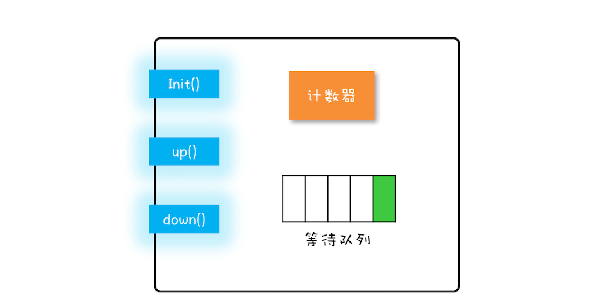

## 信号量模型

可以简单概括为：一个计数器，一个等待队列，三个方法




这三个方法详细的语义具体如下所示。

- init()：设置计数器的初始值。
- down()：计数器的值减 1；如果此时计数器的值小于 0，则当前线程将被阻塞，否则当前线程可以继续执行。
- up()：计数器的值加 1；如果此时计数器的值小于或者等于 0，则唤醒等待队列中的一个线程，并将其从等待队列中移除。

信号量模型是由 `java.util.concurrent.Semaphore` 实现的，`Semaphore` 这个类能够保证这三个方法都是原子操作。

实现方式大概如下:

```java

class Semaphore{
  // 计数器
  int count;
  // 等待队列
  Queue queue;
  // 初始化操作
  Semaphore(int c){
    this.count=c;
  }
  // 
  void down(){
    this.count--;
    if(this.count<0){
      //将当前线程插入等待队列
      //阻塞当前线程
    }
  }
  void up(){
    this.count++;
    if(this.count<=0) {
      //移除等待队列中的某个线程T
      //唤醒线程T
    }
  }
}
```


### 如何使用信号量

```java

static int count;
//初始化信号量
static final Semaphore s = new Semaphore(1);
//用信号量保证互斥    
static void addOne() {
  s.acquire();//acquire() 就是信号量里的 down() 操作
  try {
    count+=1;
  } finally {
    s.release();//up()
  }
}
```


## 总结


