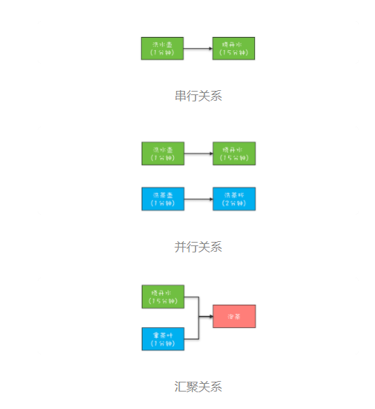
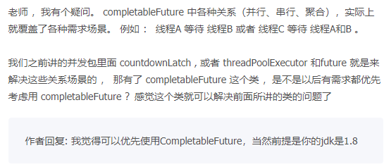
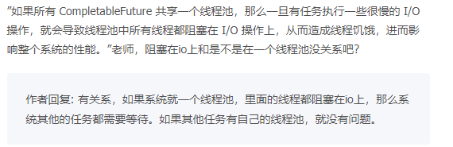
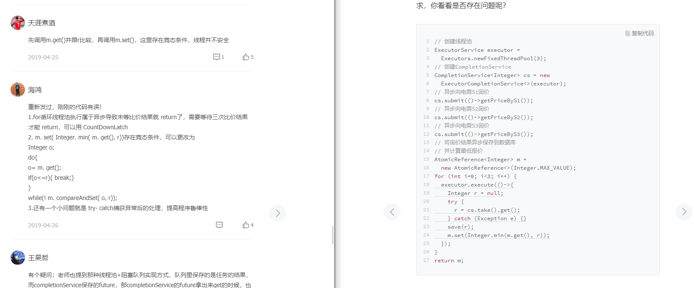

## 24 | CompletableFuture：异步编程没那么难

runAsync(Runnable runnable)和supplyAsync(Supplier<\U> supplier)，它们之间的区别是：Runnable 接口的 run() 方法没有返回值，而 Supplier 接口的 get() 方法是有返回值的。


```

//任务1：洗水壶->烧开水
CompletableFuture<Void> f1 = 
  CompletableFuture.runAsync(()->{
  System.out.println("T1:洗水壶...");
  sleep(1, TimeUnit.SECONDS);

  System.out.println("T1:烧开水...");
  sleep(15, TimeUnit.SECONDS);
});
//任务2：洗茶壶->洗茶杯->拿茶叶
CompletableFuture<String> f2 = 
  CompletableFuture.supplyAsync(()->{
  System.out.println("T2:洗茶壶...");
  sleep(1, TimeUnit.SECONDS);

  System.out.println("T2:洗茶杯...");
  sleep(2, TimeUnit.SECONDS);

  System.out.println("T2:拿茶叶...");
  sleep(1, TimeUnit.SECONDS);
  return "龙井";
});
//任务3：任务1和任务2完成后执行：泡茶
CompletableFuture<String> f3 = 
  f1.thenCombine(f2, (__, tf)->{
    System.out.println("T1:拿到茶叶:" + tf);
    System.out.println("T1:泡茶...");
    return "上茶:" + tf;
  });
//等待任务3执行结果
System.out.println(f3.join());

void sleep(int t, TimeUnit u) {
  try {
    u.sleep(t);
  }catch(InterruptedException e){}
}
// 一次执行结果：
T1:洗水壶...
T2:洗茶壶...
T1:烧开水...
T2:洗茶杯...
T2:拿茶叶...
T1:拿到茶叶:龙井
T1:泡茶...
上茶:龙井
```

### 创建 CompletableFuture 对象
默认情况下 CompletableFuture 会使用公共的 ForkJoinPool 线程池，这个线程池默认创建的线程数是 CPU 的核数（也可以通过 JVM option:-Djava.util.concurrent.ForkJoinPool.common.parallelism 来设置 ForkJoinPool 线程池的线程数）

如果所有 CompletableFuture 共享一个线程池，那么一旦有任务执行一些很慢的 I/O 操作，就会导致线程池中所有线程都阻塞在 I/O 操作上，从而造成线程饥饿


根据不同的业务类型创建不同的线程池，以避免互相干扰。


```

//使用默认线程池
static CompletableFuture<Void> 
  runAsync(Runnable runnable)
static <U> CompletableFuture<U> 
  supplyAsync(Supplier<U> supplier)
//可以指定线程池  
static CompletableFuture<Void> 
  runAsync(Runnable runnable, Executor executor)
static <U> CompletableFuture<U> 
  supplyAsync(Supplier<U> supplier, Executor executor)  
```

### 如何理解 CompletionStage 接口



你可以站在分工的角度类比一下工作流。任务是有时序关系的，比如有串行关系、并行关系、汇聚关系等。这样说可能有点抽象，这里还举前面烧水泡茶的例子，其中洗水壶和烧开水就是串行关系，洗水壶、烧开水和洗茶壶、洗茶杯这两组任务之间就是并行关系，而烧开水、拿茶叶和泡茶就是汇聚关系。


f3 = f1.thenCombine(f2, ()->{}) 描述的就是一种汇聚关系。

烧水泡茶程序中的汇聚关系是一种AND聚合关系，这里的AND指的是所有依赖的任务（烧开水和拿茶叶）都完成后才开始执行当前任务（泡茶）。

OR 聚合关系，所谓 OR 指的是依赖的任务只要有一个完成就可以执行当前任务。

#### 1. 描述串行关系

```
CompletionStage<R> thenApply(fn);
CompletionStage<R> thenApplyAsync(fn);

CompletionStage<Void> thenAccept(consumer);
CompletionStage<Void> thenAcceptAsync(consumer);

CompletionStage<Void> thenRun(action);
CompletionStage<Void> thenRunAsync(action);

CompletionStage<R> thenCompose(fn);
CompletionStage<R> thenComposeAsync(fn);
```

```
CompletableFuture<Void> f1 = CompletableFuture.runAsync(() -> {//runAsync 没有返回值
            System.out.println("工具准备");
        });


        CompletableFuture<String> f2 = CompletableFuture.supplyAsync(() -> {//supplyAsync 有返回值
            System.out.println("茶叶准备");
            return "龙井";
        });

        CompletableFuture<String> f3 = f1.thenCombine(f2, (unused, s) -> {
            System.out.println(unused + ":" + s);
            System.out.println("泡茶");
            return "上茶" + s;
        });

        f3.join();
        
        CompletableFuture<Object> objectCompletableFuture = f1.thenApply(new Function<Void, Object>() {
            @Override
            public Object apply(Void unused) {
                return new Object();
            }
        });

        CompletableFuture<Void> voidCompletableFuture = f1.thenAccept(new Consumer<Void>() {
            @Override
            public void accept(Void unused) {

            }
        });

        CompletableFuture<Void> voidCompletableFuture1 = f1.thenRun(new Runnable() {
            @Override
            public void run() {
            }
        });

        CompletableFuture<Integer> objectCompletableFuture1 = f1.thenCompose(new Function<Void, CompletionStage<Integer>>() {
            @Override
            public CompletionStage<Integer> apply(Void unused) {
                return new CompletableFuture<Integer>();
            }
        });
        
});

```

- thenApply 系列函数里参数 fn 的类型是接口 `Function<T, R>`，这个接口里与 CompletionStage 相关的方法是 R apply(T t)，这个方法既能接收参数也支持返回值，所以 thenApply 系列方法返回的是`CompletionStage<R>`。
- 而 thenAccept 系列方法里参数 consumer 的类型是接口Consumer<T>，这个接口里与 CompletionStage 相关的方法是 void accept(T t)，这个方法虽然支持参数，但却不支持回值，所以 thenAccept 系列方法返回的是CompletionStage<Void>。
- thenRun 系列方法里 action 的参数是 Runnable，所以 action 既不能接收参数也不支持返回值，所以 thenRun 系列方法返回的也是CompletionStage。
- 这些方法里面 Async 代表的是异步执行 fn、consumer 或者 action。其中，需要你注意的是 thenCompose 系列方法，这个系列的方法会新创建出一个子流程，最终结果和 thenApply 系列是相同的。

#### 2. 描述 AND 汇聚关系


```

CompletionStage<R> thenCombine(other, fn);
CompletionStage<R> thenCombineAsync(other, fn);
CompletionStage<Void> thenAcceptBoth(other, consumer);
CompletionStage<Void> thenAcceptBothAsync(other, consumer);
CompletionStage<Void> runAfterBoth(other, action);
CompletionStage<Void> runAfterBothAsync(other, action);
```

### 3. 描述 OR 汇聚关系
```

CompletionStage applyToEither(other, fn);
CompletionStage applyToEitherAsync(other, fn);
CompletionStage acceptEither(other, consumer);
CompletionStage acceptEitherAsync(other, consumer);
CompletionStage runAfterEither(other, action);
CompletionStage runAfterEitherAsync(other, action);
```

```
public class ITest24 {
    public static void main(String[] args) {

        CompletableFuture<String> f1 =
                CompletableFuture.supplyAsync(() -> {
                    int t = (int) (Math.random() * 4+1);
                    sleep(t, TimeUnit.SECONDS);
                    return String.valueOf(t)+"---f1";
                });

        CompletableFuture<String> f2 =
                CompletableFuture.supplyAsync(() -> {
                     int t = (int) (Math.random() * 4+1);
                    sleep(t, TimeUnit.SECONDS);
                    return String.valueOf(t)+"---f2";
                });

        CompletableFuture<String> f3 = f1.applyToEither(f2, s -> s);

        System.out.println(f3.join());
    }

    static void sleep(int t, TimeUnit u) {  try {    u.sleep(t);  }catch(InterruptedException e){}}
}

```
### 4. 异常处理

虽然上面我们提到的 fn、consumer、action 它们的核心方法都不允许抛出可检查异常，但是却无法限制它们抛出运行时异常


非异步编程里面，我们可以使用 try{}catch{}来捕获并处理异常，那在异步编程里面，异常该如何处理呢？

```

CompletionStage exceptionally(fn);  //

CompletionStage<R> whenComplete(consumer);//不支持返回结果
CompletionStage<R> whenCompleteAsync(consumer);

CompletionStage<R> handle(fn); //支持返回结果
CompletionStage<R> handleAsync(fn);
```
 - exceptionally() 方法来处理异常，exceptionally() 的使用非常类似于 try{}catch{}中的 catch{}
 - whenComplete() 和 handle() 系列方法就类似于 try{}finally{}中的 finally{}
 - consumer不支持返回结果,  fn支持返回结果


```

CompletableFuture<Integer> 
  f0 = CompletableFuture
    .supplyAsync(()->(7/0))
    .thenApply(r->r*10)
    .exceptionally(e->0);
System.out.println(f0.join());
```


### 课后思考
```

//采购订单
PurchersOrder po;
CompletableFuture<Boolean> cf = 
  CompletableFuture.supplyAsync(()->{
    //在数据库中查询规则
    return findRuleByJdbc();
  }).thenApply(r -> {
    //规则校验
    return check(po, r);
});
Boolean isOk = cf.join();
```


思考题:
1，读数据库属于io操作，应该放在单独线程池，避免线程饥饿  
2，异常未处理

思考题：
1.没有进行异常处理， 
2.要指定专门的线程池做数据库查询 
3.如果检查和查询都比较耗时，那么应该像之前的对账系统一样，采用生产者和消费者模式，让上一次的检查和下一次的查询并行起来。 



## 总结
对于简单的并行任务，你可以通过“线程池 +Future”的方案来解决；如果任务之间有聚合关系，无论是 AND 聚合还是 OR 聚合，都可以通过 CompletableFuture 来解决；而批量的并行任务，则可以通过 CompletionService 来解决。